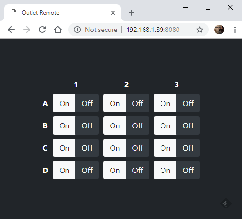
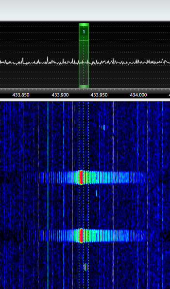

### Purpose
This tool generates IQ samples that can be transmitted using a software-defined radio to control Woods M35C-A wireless outlets.

### Requirements
 * Go >=1.11
 * [F5OEO's rpitx](https://github.com/F5OEO/rpitx)
 * Raspberry Pi compatible with rpitx

### Building
Obtain the source code:

	go get -v github.com/bemasher/woodstx

Build and install the tool:

	go install -v github.com/bemasher/woodstx

This will produce the binary `$GOPATH/bin/woodstx`.

For convenience it's common to add `$GOPATH/bin` to the path.

### Usage
`woodstx` writes IQ samples directly to `/dev/stdout` so it's output should be redirected into a file, or piped into a transmitter like `sendiq` from the `rpitx` project. You can use any other SDR that supports transmitting IQ data, but that is left as an exercise for the user.

```bash
woodstx | sudo sendiq -i - -t u8 -f 433930000 -s 150000
```

`woodstx` is controlled through a http interface that listens on port 8080. The assets needed for the interface are stored in `$GOPATH/src/github.com/bemasher/woodstx/`, You can move the assets to any directory you like so long as they are in the executable's working directory.



The signal produced by `woodstx` when transmitted with `sendiq` is relatively clean for an OOK modulation.



See the wiki for more information about the message structure and signal properties.

### Feedback
If you have any questions, comments, feedback or bugs, please submit an issue.
